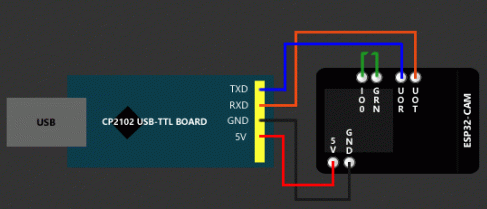

# Micro-Camera

This tutorial gives step by step instructions on how to set up MicroPython on the ESP32-CAM development board and turn it into a small digital camera that can take photos and save them on a SD card. The ESP32-CAM development board is a breakout board for the ESP32 that come with an SD card slot capable of up to 4 GB, OV2640 camera and a very bright led making it perfect for this project.


## Flashing MicroPython onto the ESP32-CAM

I found that the best version of the firmware is maintained by [shariltumin](https://github.com/shariltumin) and can be found [here](https://github.com/shariltumin/esp32-cam-micropython/tree/master/firmwares) to download. Be sure that you check out his [blog](https://kopimojo.blogspot.com/) where he discusses the progress of his Micropython webcam project.

Once the firmware is downloaded, you need to install the **esptool**:

```shell
pip install esptool
```

Connect your USB to TTL UART Serial Converter to the ESP32-CAM board and put it in bootloader mode by connecting the IO0 pin to ground (shown in green).



_press RST button_

Then, erase the flash one the ESP32:

```shell
esptool.py --port /dev/ttyUSB0 erase_flash
```

cd into the directory that you put the firmware in and:

_press RST button_

```shell
esptool.py --chip esp32 --port /dev/ttyUSB0 --baud 460800 write_flash -z 0x1000 ESP32CAM_firmware.bin
```

Now you have microython on the ESP32-CAM board!

Disconnect the IO0 pin from ground then _press RST button_

## Put the micropython code on the ESP32-CAM board

Install ampy

```shell
pip install adafruit-ampy
```

Clone Micro-Camera code:

```shell
git clone https://github.com/KipCrossing/Micro-Camera
```

Go into the Micro-camera directory:

```shell
cd Micro-Camera
```

And put the code on the board

```shell
ampy --port /dev/ttyUSB0 put boot.py
ampy --port /dev/ttyUSB0 put main.py
```

Insert an SD card, press RST button and see the camera flash and take a photo.

## Camera module

```python
import camera

# Setup camera perams
camera.framesize(12) # between 0 and 13
camera.quality(63) # between 9 and 64
camera.contrast(0) # between -3 and 3
camera.saturation(0) # between -3 and 3
camera.brightness(0) # between -3 and 3
camera.speffect(3) # between 0 and  7
camera.whitebalance(2) # between 0 and 5
camera.agcgain(0) # between 0 and 30
camera.aelavels(0) # between -3 and 3
camera.aecvalue(100) # between 0 1200
camera.pixformat(0) # 0 for JPEG, 1 for YUV422 and 2 for RGB

fmt (0:JPEG, 1:YUV422, 2:RGB) - pixformat
agc (0 to 30) - agcgain
ael (-2 t0 +2) - aelavels
aev (0 to 1200) - aecvalue

# take Photo
camera.init()
buf = camera.capture()
camera.deinit()
```

## Flash LED

The flash led is controlled by pin 4

```python
import machine
import time

led = machine.Pin(4, machine.Pin.OUT)
led.on()
time.sleep(0.2)
led.off()
```

## mounting the SD card

```python
import uos
import machine

uos.mount(machine.SDCard(), "/sd")

# Open file in SD

f = open("sd/" + tfile, 'wb')
```
